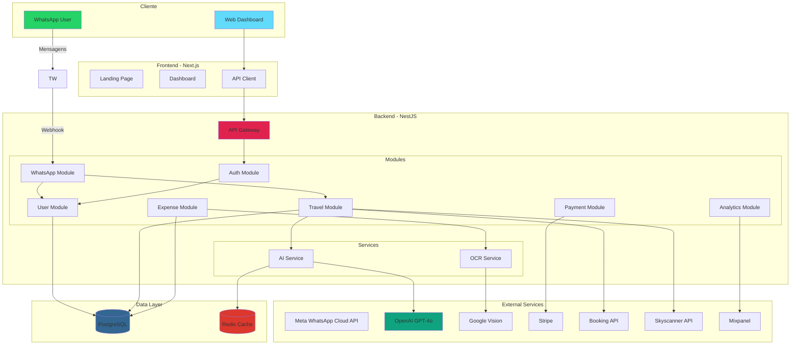
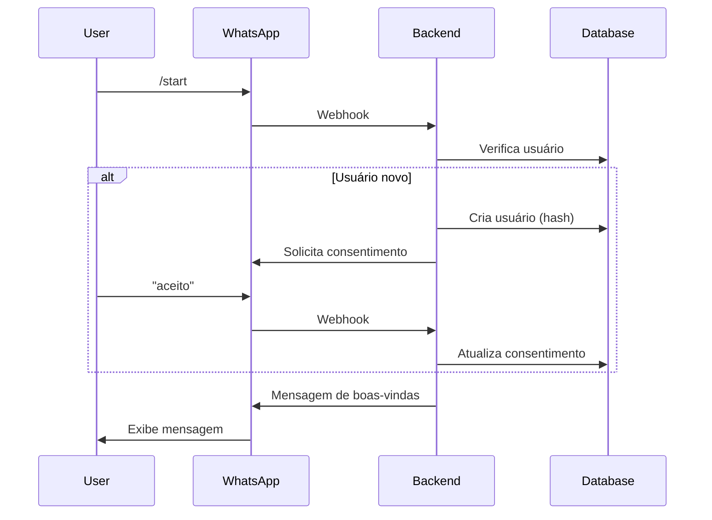
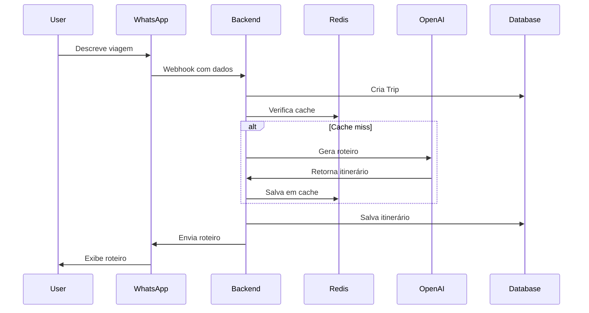
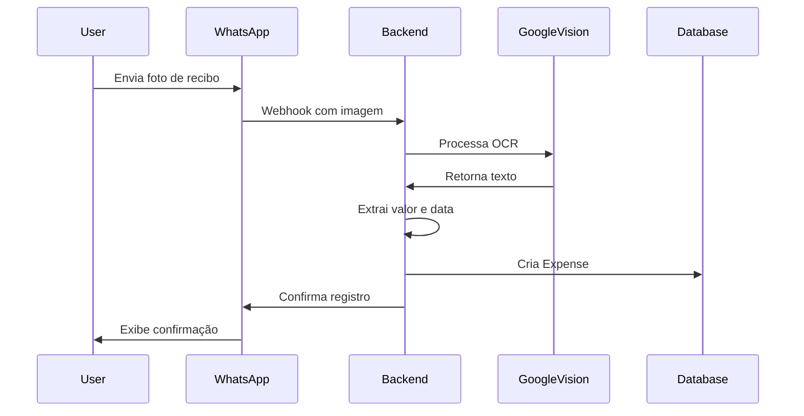

# Arquitetura do TravelBot Pro

## Visão Geral

TravelBot Pro é um sistema de agente de viagens inteligente baseado em monorepo TypeScript, com backend NestJS e frontend Next.js.

## Diagrama de Arquitetura



## Fluxo de Dados Principal

### 1. Onboarding via WhatsApp


### 2. Geração de Roteiro com IA


### 3. Processamento de Gastos via OCR


## Estrutura de Pastas

```
travel-ia/
├── backend/              # Backend NestJS
│   ├── src/
│   │   ├── whatsapp/    # Módulo WhatsApp
│   │   ├── travel/      # Módulo Viagens
│   │   ├── user/        # Módulo Usuário
│   │   ├── auth/        # Módulo Autenticação
│   │   ├── payment/     # Módulo Pagamento
│   │   ├── expense/     # Módulo Despesas
│   │   ├── analytics/   # Módulo Analytics
│   │   └── config/      # Configurações
│   └── package.json
├── frontend/             # Frontend Next.js
│   ├── app/             # Pages (App Router)
│   ├── components/      # Componentes React
│   ├── lib/             # Utilitários e API
│   └── package.json
├── shared/              # Código compartilhado
│   ├── src/
│   │   ├── types/       # Tipos TypeScript
│   │   ├── constants/   # Constantes
│   │   └── utils/       # Utilitários
│   └── package.json
├── docs/                # Documentação
├── package.json         # Raiz (workspaces)
└── tsconfig.json        # Config TypeScript
```

## Tecnologias Principais

### Backend
- **NestJS**: Framework Node.js
- **TypeORM**: ORM para PostgreSQL
- **Meta WhatsApp Cloud API**: API oficial WhatsApp (1000 conversas grátis/mês)
- **OpenAI**: GPT-4o para IA
- **Google Vision**: OCR

- **Stripe**: Pagamentos
- **Redis**: Cache

### Frontend
- **Next.js 14**: Framework React
- **Tailwind CSS**: Estilização
- **Chart.js**: Gráficos
- **Axios**: Cliente HTTP

### Database
- **PostgreSQL**: Banco principal
- **Redis**: Cache e sessões

## Segurança

1. **Hash de números WhatsApp** (SHA-256)
2. **JWT** para autenticação dashboard
3. **Rate limiting** em todas as APIs
4. **HTTPS** obrigatório em produção
5. **Validação** de dados com class-validator
6. **Consentimento LGPD/GDPR** no onboarding

## Escalabilidade

- **Horizontal**: Auto-scaling AWS/Vercel
- **Cache**: Redis para reduzir custos IA
- **Rate Limiting**: 100 requests/minuto
- **Database**: Connection pooling
- **CDN**: Assets estáticos

## Monitoramento

- **Mixpanel**: Analytics e conversões
- **Logs**: Winston/Pino
- **Alertas**: Erros em tempo real
- **Performance**: <3s resposta média

